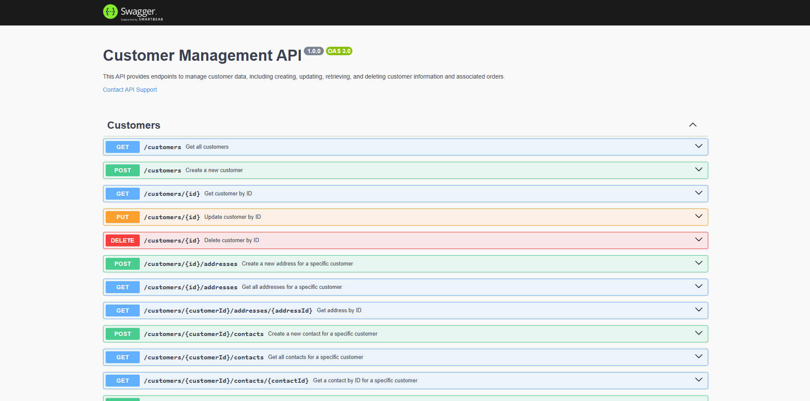

# 🛠️ User Management Backend API

This project is a backend RESTful API built with Node.js and Express.js, utilizing Sequelize ORM to interact with a PostgreSQL database. The API manages user-related data, including Customers, their Addresses, Contacts, and Orders. The database schema consists of four main tables: `customers`, `addresses`, `contacts`, and `orders`, each with specific relationships and fields.

## 📜 Preview of the API Documentation



## 📋 Table of Contents

- [Features](#features)
- [Installation](#installation)
- [Environment Variables](#environment-variables)
- [Usage](#usage)
- [API Endpoints](#api-endpoints)
- [Dependencies](#dependencies)

---

## ✨ Features

- **CRUD operations** for Customers, Addresses, Contacts, and Orders.
- **Associations** between tables to allow for efficient relational data handling.
- **Validation** with Joi for request data integrity.
- **API Documentation** with Swagger UI.
- **Support for CORS** to allow cross-origin requests.
- **Error Handling** middleware to catch and log errors.
- **Environment Variables** for configuration and security.
- **Database Migrations** with Sequelize CLI.
- **Database Seeding** with Faker.js for testing purposes.

---

## 🛠 Installation

1. **Clone the repository**:
   ```bash
   git clone https://github.com/rifqi142/assignment5_muhrifqis
   cd assignment5_muhrifqis
   ```
2. **Install the dependencies**:
   ```bash
    npm install
   ```
3. **Set up the environment variables**:
   - Create a `.env` file in the root directory.
   - Copy the contents of `.env.example` into `.env`.
   - Modify the environment variables as needed.
   ```bash
   DB_HOST=your_db_host
   DB_PORT=your_db_port
   DB_NAME=your_db_name
   DB_USER=your_db_user
   DB_PASSWORD=your_db_password
   ```
4. **Run the migrations, and seeders for data**:
   ```bash
   npm run migration:up
   npm run seed:all
   ```
5. **Start the server**:
   ```bash
    npm start
   ```
6. **Access the API**:
   - Open your browser and navigate to `http://localhost:8080/api-docs` to view the Swagger UI documentation.

---

## 🌐 Environment Variables

This project uses the following environment variables:

- DB_HOST: Database host (e.g., localhost).
- DB_PORT: Database port (e.g., 5432).
- DB_NAME: Name of the database.
- DB_USER: Database username.
- DB_PASSWORD: Database password.

---

## 🚀 Usage

Use an API client like Postman or curl to test the API. Example requests and sample data are described below.

### ✏️ API Endpoints

#### 🧑 Customers

| Method | Endpoint       | Description           |
| ------ | -------------- | --------------------- |
| GET    | /customers     | Get all customers     |
| GET    | /customers/:id | Get customer by ID    |
| POST   | /customers     | Create a new customer |
| PUT    | /customers/:id | Update customer by ID |
| DELETE | /customers/:id | Delete customer by ID |

#### 📍 Addresses

| Method | Endpoint                     | Description                         |
| ------ | ---------------------------- | ----------------------------------- |
| GET    | /customers/:id/addresses     | Get all addresses for a customer    |
| GET    | /customers/:id/addresses/:id | Get address by ID for a customer    |
| POST   | /customers/:id/addresses     | Create a new address for a customer |
| PUT    | /addresses/:id               | Update address by ID                |
| DELETE | /addresses/:id               | Delete address by ID                |

#### 📞 Contacts

| Method | Endpoint                    | Description                         |
| ------ | --------------------------- | ----------------------------------- |
| GET    | /customers/:id/contacts     | Get all contacts for a customer     |
| GET    | /customers/:id/contacts/:id | Get contact by ID for a customer    |
| POST   | /customers/:id/contacts     | Create a new contact for a customer |
| PUT    | /contacts/:id               | Update contact by ID                |
| DELETE | /contacts/:id               | Delete contact by ID                |

#### 📦 Orders

| Method | Endpoint                  | Description                       |
| ------ | ------------------------- | --------------------------------- |
| GET    | /customers/:id/orders     | Get all orders for a customer     |
| GET    | /customers/:id/orders/:id | Get order by ID for a customer    |
| POST   | /customers/:id/orders     | Create a new order for a customer |
| PUT    | /orders/:id               | Update order by ID                |
| DELETE | /orders/:id               | Delete order by ID                |

---

## 📘 API Documentation

The API is documented with Swagger. You can access the documentation at /api-docs when the server is running.

---

## 📦 Dependencies

This project utilizes the following dependencies:

- Express - Fast, unopinionated, minimalist web framework for Node.js.
- Sequelize - Promise-based ORM for Node.js and PostgreSQL.
- @sequelize/postgres - PostgreSQL dialect for Sequelize.
- Joi - Data validation library for JavaScript.
- Swagger - Tools for documenting APIs.
- CORS - Middleware to enable CORS with various options.
- dotenv - Loads environment variables from .env file.
- Nodemon - Utility to automatically restart the server for changes.

## 🧑🏻‍💻 Author

- [@Muhammad Rifqi Setiawan](https://github.com/rifqi142)

## 📄 License

This project is licensed under the MIT License. See the LICENSE file for details.
